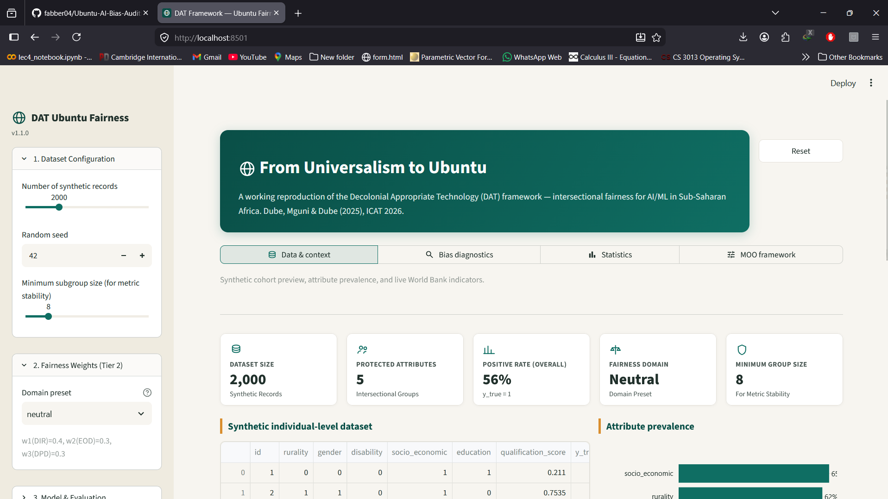
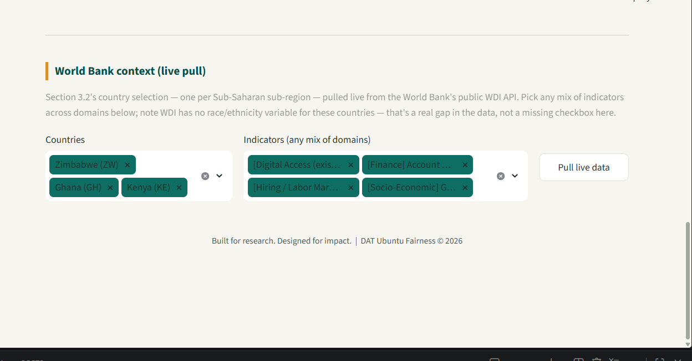
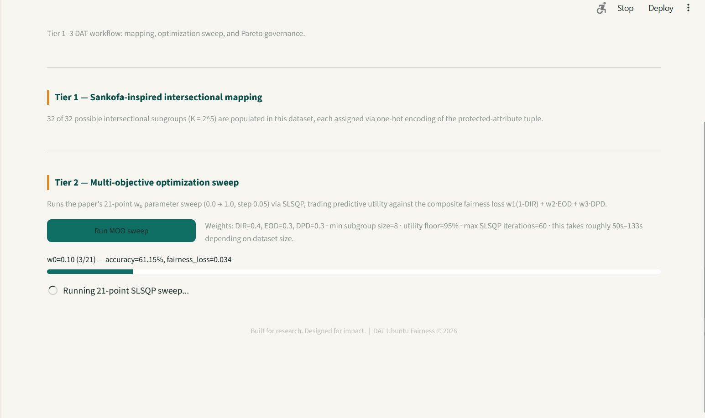

# DAT Framework — Decolonial Appropriate Technology

Reference implementation of the framework from:

> Dube, S. C., Mguni, M., & Dube, S. S. (2025). *From Universalism to Ubuntu: A decolonial
> approach to intersectional fairness in Machine Learning for Sub-Saharan Africa.* ICAT 2026.

This repo reproduces the paper's three-phase methodology end to end:

1. **Data collection** — pulls World Bank World Development Indicators for one country
   per Sub-Saharan African sub-region, and generates a DHS-like synthetic individual-level
   dataset (rurality, gender, disability, socio-economic status + outcome) calibrated to
   roughly match the paper's reported baseline bias levels. Swap in a real DHS extract
   (`.dta` → converted) the moment you have Program access — the pipeline doesn't care
   where the rows came from as long as the column names match.
2. **Fairness diagnostics** — Disparate Impact Ratio (DIR), Equalized Odds Difference (EOD),
   Demographic Parity Difference (DPD), computed per single attribute and per intersectional
   subgroup (Cartesian product, one-hot).
3. **Statistical validation** — paired t-tests (single vs. intersectional) and a factorial
   ANOVA proving intersectional harm is non-additive.
4. **Tier 1–3 DAT framework**:
   - Tier 1 — Sankofa-inspired null-space projection to strip latent proxies for protected
     attributes below an information-leakage threshold ε.
   - Tier 2 — Multi-objective optimization engine (SLSQP parameter sweep, w₀ from 0→1 in
     0.05 steps) trading off predictive utility against composite fairness loss
     (w₁(1-DIR) + w₂·EOD + w₃·DPD).
   - Tier 3 — Ubuntu-based Pareto frontier extraction + governance layer for human-in-the-loop
     model selection.

## Repo layout

```
dat-framework/
├── src/dat_framework/
│   ├── config.py              # countries, indicators, protected attributes, weights
│   ├── data/
│   │   ├── worldbank.py       # World Bank WDI API client
│   │   └── synthetic_dhs.py   # DHS-like synthetic generator (calibrated to paper stats)
│   ├── metrics/
│   │   ├── fairness_metrics.py  # DIR, EOD, DPD (single-attribute + intersectional)
│   │   └── stats_tests.py       # t-tests + factorial ANOVA
│   ├── optimization/
│   │   ├── preprocessing.py   # Tier 1: null-space projection
│   │   ├── moo_engine.py      # Tier 2: SLSQP sweep + fairness loss
│   │   └── pareto.py          # Tier 3: Pareto extraction + selection helpers
│   └── pipeline.py            # glues all of the above into one callable pipeline
├── app/
│   └── streamlit_app.py       # human-friendly interface
├── tests/                     # pytest smoke tests for each module
├── data/
│   ├── raw/                   # World Bank pulls + synthetic DHS csvs land here
│   └── processed/             # metric tables, Pareto front csvs
└── requirements.txt
```

## Getting started

```bash
python -m venv .venv && source .venv/bin/activate   # or .venv\Scripts\activate on Windows
pip install -r requirements.txt
streamlit run app/streamlit_app.py
```

## Screenshots

### Dashboard


### Fairness Diagnostics


### Pareto Frontier Selection


The app will:
1. Let you pick which Sub-Saharan countries/indicators to pull from World Bank (live API call —
   needs internet).
2. Generate (or let you upload) the individual-level dataset.
3. Run Phase I/II diagnostics and show the baseline bias tables from the paper.
4. Run the ANOVA/t-test significance panel.
5. Run the Tier 1–3 MOO pipeline and let you interactively walk the Pareto frontier,
   exactly as the "Ubuntu-Based Pareto Selection Governance Layer" describes — a human,
   not the optimizer, picks the final model.

## Notes on data

- **World Bank**: hits the public WDI REST API directly (`api.worldbank.org`), no key needed.
- **DHS**: the DHS Program requires a registered researcher account and per-country/survey
  approval — this repo can't fetch that for you. `synthetic_dhs.py` generates a
  structurally-equivalent stand-in (same protected attributes, same rough bias magnitudes
  reported in the paper's Table 6.0/6.2) so the rest of the pipeline is fully runnable today.
  Point `pipeline.py` at your real DHS extract by matching the column schema documented in
  `synthetic_dhs.py`'s docstring.
